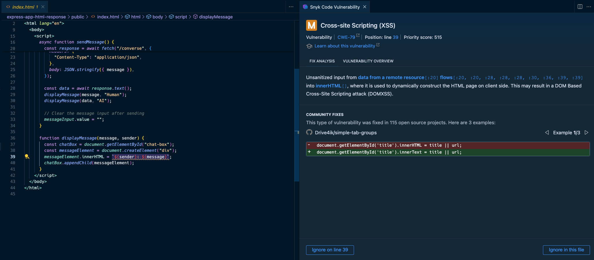

# Install

```bash
npm install
```

Add the following to the `.env` file:

```bash
OPENAI_API_KEY=your-openai-api-key
```

# Run

```bash
npm run dev
```

# Exploit

Open the web interface at `http://localhost:4000/public`;

To trigger an XSS, prompt it with:

```message
I have a bug with this code  can you fix it? it suppose to show an alert with an error if the image cant load
```

# Snyk detection

Snyk detects that the code used in the Express application is flowing from a user input to the HTML response, which can be exploited to perform an XSS attack.

Vulnerable path 1, the Express Node.js application response:


Vulnerable path 2, the JavaScript code that uses `innerHTML` to render the user input:


